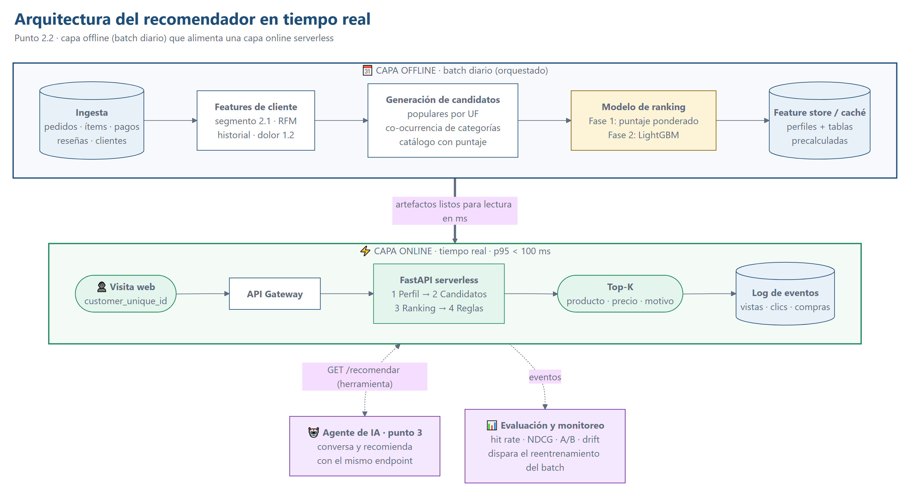
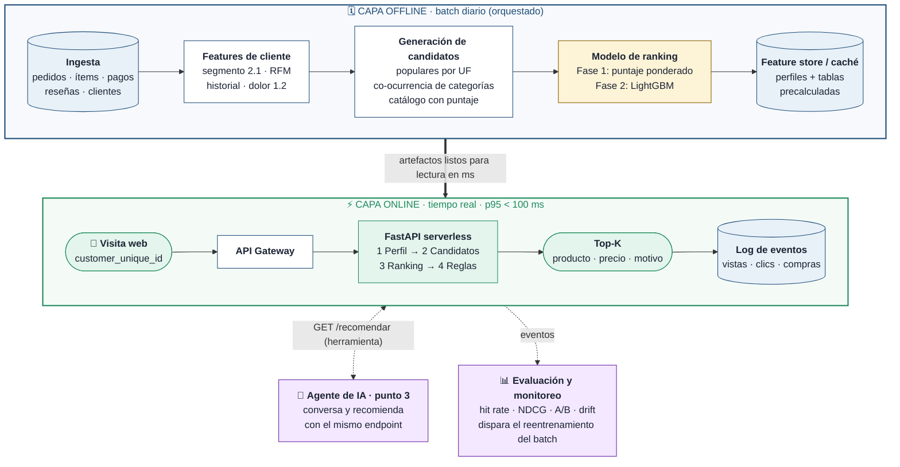

# Arquitectura del recomendador en tiempo real (Punto 2.2)

**Objetivo:** cuando un cliente entra a la web, mostrarle en milisegundos 5 productos pensados para él, según su **perfil (segmento del 2.1)** y su **historial de compras**, sin repetir lo que ya compró y cuidando al cliente que tuvo una mala experiencia (1.2).

**Principio de diseño:** todo lo pesado se calcula **offline** una vez al día; la capa **online** solo lee tablas precalculadas y aplica reglas. Así la respuesta cabe holgadamente en el presupuesto de < 100 ms.

---

## 1. Diagrama

Código Mermaid del diagrama

| Capa | Qué hace | Cuándo corre |
|---|---|---|
| **Offline** | Construye perfiles, candidatos y puntajes; los publica en el feature store | Una vez al día (o al reentrenar) |
| **Online** | Lee el perfil, arma el top-K y registra el evento | En cada visita, en milisegundos |

---

## 2. Flujo lógico: de la visita a la recomendación

1. **Visita.** El cliente entra a la web; la página (con su sesión o cookie) llama a `GET /recomendar/{customer_unique_id}`.
2. **Perfil.** El servicio lee del feature store su segmento (2.1), UF, categoría favorita, productos ya comprados y si tuvo mala experiencia (1.2). Si el ID no existe → **cliente nuevo**.
3. **Estrategia.** Según el segmento se eligen las categorías candidatas y el filtro de productos (tabla de la sección 3).
4. **Candidatos.** De cada categoría candidata se toman sus mejores productos del catálogo precalculado.
5. **Ranking.** Los productos ya vienen ordenados por puntaje (fase 1) o por la probabilidad de compra de LightGBM (fase 2).
6. **Reglas de negocio.** Se quitan los productos ya comprados, se deja 1 producto por categoría y se aplica el filtro del segmento.
7. **Respuesta.** Top-5 con producto, categoría, precio promedio real y **motivo** ("Su categoría favorita", "Quienes compran X también compran esto", "Lo más vendido en RJ").
8. **Registro.** La vista, los clics y las compras se guardan como eventos: son el insumo para evaluar y reentrenar.

---

## 3. Estrategia por tipo de cliente

La mezcla base es **favorita + 1 complementaria + tendencia de su estado**, porque fue la que mejor predijo la siguiente compra en la evaluación offline (sección 8). El segmento cambia el **orden** y el **filtro**.

| Tipo de cliente | % de la base | Qué se le recomienda | Filtro de productos |
|---|---|---|---|
| **Nuevo / anónimo** (cold start) | — | Lo más vendido en su estado en los últimos 6 meses (tendencia) | — |
| **Esporádico reciente** (1 compra) | 34,0% | Primero la categoría complementaria (co-ocurrencia), luego su favorita y populares de su UF | — |
| **Fiel** | 1,1% | Primero su favorita (afinidad), luego complementaria y populares | — |
| **VIP / Alto valor** | 9,6% | Favorita + complementaria + populares | Solo productos **premium** (precio ≥ p75 de su categoría) |
| **En riesgo / Perdido** | 55,3% | Favorita + complementaria + populares | Solo vendedores con **entrega confiable** (≥ 95% a tiempo y reseña ≥ 4) |
| **Con mala experiencia** (se suma a cualquiera) | 14,1% | Se **excluye la categoría del mal episodio** | Se exige **entrega confiable** |

Si un filtro deja menos de 5 productos, se completa sin filtro para no devolver una lista vacía.

---

## 4. Modelo

**Etapa 1 · Generación de candidatos** (offline, reduce 32.951 productos a unas decenas por cliente):
- **Populares por UF:** categorías más vendidas en el estado del cliente en los últimos 180 días.
- **Co-ocurrencia de categorías:** "quien compró X también compró Y", contada en clientes que compraron más de una categoría (mínimo 3 clientes por par). Es filtrado colaborativo ítem-ítem a nivel de categoría.
- **Catálogo con puntaje:** productos con ≥ 3 ventas, vendidos en el último año (proxy de disponibilidad).

**Etapa 2 · Ranking**
- **Fase 1 (prototipo):** puntaje = 0,5 · percentil de ventas + 0,3 · tasa de entrega a tiempo + 0,2 · reseña/5. Transparente y sin entrenamiento.
- **Fase 2 (producción):** **LightGBM** que predice la probabilidad de compra de cada par cliente–producto candidato.

| Variables de LightGBM | Ejemplos |
|---|---|
| **Del cliente** | segmento, recencia, frecuencia, gasto, ticket, score promedio, mala experiencia, UF, cuotas |
| **Del producto** | precio, ventas, % a tiempo, reseña, premium, categoría |
| **Cliente × producto** | ¿es su categoría favorita?, fuerza de co-ocurrencia, precio vs. su ticket, ¿es la categoría de su mala experiencia? |
| **Contexto** | mes, día de la semana, dispositivo, canal |

- **Target:** 1 si el cliente compró (o hizo clic, cuando haya eventos web) el candidato en los N días siguientes; 0 para candidatos mostrados y no elegidos.
- **Por qué es fase 2:** con 97% de clientes de una sola compra solo hay ~550-670 casos de recompra para entrenar. Se activa cuando el log de eventos acumule vistas y clics.

---

## 5. Reglas de negocio

| Regla | Implementación |
|---|---|
| No recomendar lo ya comprado | Se excluyen los `product_id` del historial del cliente |
| Diversidad | Máximo 1 producto por categoría en el top-5 |
| Disponibilidad | Solo productos vendidos en el último año de la ventana |
| Cuidar el dolor (1.2) | Sin la categoría de la mala experiencia; solo vendedores confiables |
| Transparencia | Cada producto trae su **motivo** (útil para la web y para el agente) |

---

## 6. Requisitos no funcionales

**Presupuesto de latencia (p95 < 100 ms):**

| Componente | Presupuesto | Medido en el prototipo |
|---|---|---|
| Red cliente ↔ API Gateway | 20-40 ms | — |
| API Gateway + invocación serverless (en caliente) | 10-15 ms | — |
| Lectura del perfil (Redis / DynamoDB) | 1-5 ms | en memoria |
| Candidatos + ranking + reglas | 1-15 ms (LightGBM en fase 2) | **0,07 ms promedio** |
| **Total estimado** | **~35-75 ms** | 8,0 ms prom · 10,6 ms p95 con HTTP local (100 requests) |

- **Caché:** los artefactos se cargan una vez al iniciar el servicio (5,8 MB comprimidos); cada petición solo consulta diccionarios.
- **Escalabilidad:** el servicio no guarda estado, así que escala horizontal y automáticamente (Lambda / Cloud Run).
- **Arranque en frío:** concurrencia aprovisionada (Lambda) o instancias mínimas (Cloud Run) en horas pico.
- **Fallback:** si el feature store o el modelo fallan o tardan más de 50 ms, se responde con los populares de la UF, que viven en memoria. Nunca se devuelve una lista vacía.

---

## 7. Tecnología en la nube

| Función | AWS | GCP |
|---|---|---|
| Entrada HTTP | API Gateway / Lambda Function URL | Cloud Run (HTTPS nativo) / API Gateway |
| Servicio FastAPI | Lambda | Cloud Run |
| Feature store online | DynamoDB o ElastiCache (Redis) | Firestore, Memorystore o Vertex AI Feature Store |
| Datos y batch | S3 + Glue / Athena | Cloud Storage + BigQuery |
| Entrenamiento (fase 2) | SageMaker | Vertex AI Training |
| Orquestación diaria | Step Functions + EventBridge | Cloud Composer / Workflows + Cloud Scheduler |
| Log de eventos | Kinesis Data Firehose → S3 | Pub/Sub → BigQuery |
| Monitoreo | CloudWatch + SageMaker Model Monitor | Cloud Monitoring + Vertex AI Model Monitoring |
| Agente de IA (punto 3) | Amazon Bedrock | Vertex AI (Gemini) |

---

## 8. Evaluación y monitoreo

**Offline (hecha en el prototipo):** se entrena con los pedidos anteriores a una fecha de corte y se mide si el cliente compró después alguna de las categorías recomendadas (**hit rate@5**). Se compara contra recomendar lo más vendido del país.

| Corte | Clientes de prueba | Recomendador | Popularidad | Diferencia |
|---|---|---|---|---|
| 2018-01-02 | 659 | **50,4%** | 45,8% | +4,6 pp |
| 2018-03-03 | 667 | **49,8%** | 46,6% | +3,2 pp |
| 2018-05-02 | 550 | **49,3%** | 46,0% | +3,3 pp |

La mejora es **modesta pero consistente** en los tres cortes. La muestra es pequeña (solo recompradores), así que el número definitivo lo debe dar un A/B test.

**Online:**
- **A/B test:** recomendador vs. popularidad; métricas de CTR, conversión, ticket e ingreso por visita.
- **Guardarraíles:** latencia p95, tasa de error y % de respuestas servidas por el fallback.
- **Drift:** cambios en la mezcla de segmentos y en las ventas por categoría (PSI); los umbrales del 2.1 (171 y 281 días) se recalculan cada mes.
- **Reentrenamiento:** batch diario de tablas; LightGBM mensual o cuando el drift supere el umbral.

---

## 9. Conexión con el Agente de IA (punto 3)

El mismo endpoint es una **herramienta** del agente:

1. El cliente conversa con el agente.
2. El agente llama `GET /recomendar/{customer_unique_id}` y recibe productos, precio, **motivo** y perfil (segmento, mala experiencia).
3. El agente no inventa productos: explica los recomendados con el tono del system prompt de su segmento (3.2). Si el cliente tuvo mala experiencia, primero la reconoce y después recomienda.

**El recomendador decide qué ofrecer; el agente decide cómo decirlo.**

---

## 10. Prototipo vs. producción

| Componente | Prototipo (este repo) | Producción |
|---|---|---|
| Batch | `src/recommender.py` → `construir_artefactos()` | Job diario orquestado |
| Feature store | JSON comprimido en memoria | DynamoDB / Redis |
| Ranking | Puntaje ponderado | LightGBM |
| Servicio | FastAPI (`api/main.py`) + página de demo | FastAPI en Lambda / Cloud Run |
| Eventos | — | Firehose / Pub/Sub |
